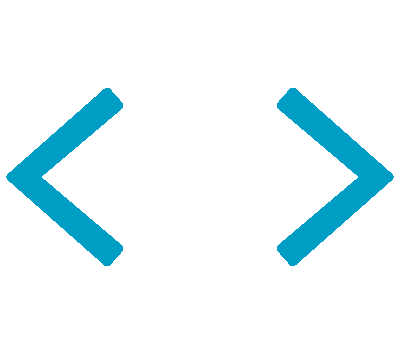

  

#  Hello, My name is Simakixi
### This is my profile!

#  Status

Tech Stack

  
  
  
  
  
  
  
  
  
  
  

  
Projects

### 🔸 [iwasakiPosSystem](https://github.com/kurappy-14/iwasakiPosSystem)
- 学園祭などの小規模な物販で販売時点管理をするシステム
- 在庫管理、売上追跡、電子決済導入などの機能
- 使用技術: HTML, CSS, JavaScript, PHP, Docker

  
Trophies

  
Certifications

<h3>🔸基本情報技術者</h3>

  
Links

  
  

